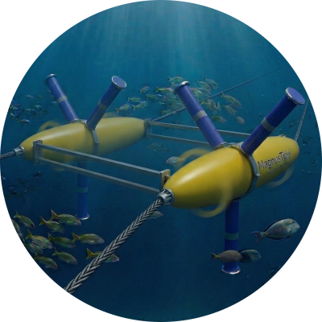

<h1>
 MagnusTide
</h1>

*Submerged Twin-Magnus Hydrokinetic Turbine*

Software License: Apache 2
Device License: CERN-OHL

MagnusTide is an open-source, submerged Tension Leg Platform (TLP) hydrokinetic turbine designed for high-velocity tidal straits (>3.0 m/s). This repository contains the custom-built Kinematic & Fluid Dynamics Simulation Engine developed to validate the core mechanical and hydrodynamic concepts of the system.

> EU-CONEXUS Innovation Contest 2025 Submission > Challenge #1: Coastal Resilience and Climate Adaptation & Challenge #4: Smart Coastal Mobility and Logistics (Decarbonization).

## The Engineering Philosophy: Survivability over Aerodynamic Perfection

The tidal energy industry is currently bottlenecked by catastrophic structural failures (due to cavitation, debris impact, and biofouling on complex airfoils) or regulatory hurdles (due to dynamic tethered kites endangering marine life). 

MagnusTide abandons traditional fragile airfoils. Instead, it utilizes active Magnus-effect rotors (smooth, blunt PVC cylinders). 

### Key Unique Selling Points (USPs):
1. Extreme Survivability: Smooth cylinders deflect debris and resist cavitation. We willingly accept a lower Coefficient of Power due to the parasitic load of the spin motors, because in >3.0 m/s currents, the raw kinetic energy is immense. We optimize for Cost-to-Performance (LCOE), not Power-to-Performance.
2. 100% Fish-Friendly (Static Mooring): Unlike tidal kites that sweep large ocean volumes with deadly tethers, MagnusTide uses strictly static TLP mooring. The rotating blunt cylinders create a massive bow wave that safely repels marine life.
3. Passive Survivability: In extreme storm events, power to the internal spin motors is cut. The Magnus effect collapses instantly, turning the turbine into a passive, low-drag obstacle without the need for complex mechanical braking or pitch control systems.

## About the Simulation Engine

This repository hosts the Python-based physics engine used to determine the optimal design parameters (Hub size, aspect ratios, spin ratios). It calculates forces dynamically rather than relying on static lookup tables.

### Engine Features:
 Dynamic Lift & Drag Calculation: Computes vectors based on the Spin Ratio ($\alpha = \text{Surface Velocity} / \text{Free-Stream Velocity}$).
 Thom Disc Integration: Models the suppression of induced drag (tip vortices) through endplates.
 Parasitic Load Modeling: Accurately deducts the power consumed by the IP68 spin motors to provide the Net Power Output.
 Real-time 3D Rendering: Uses `PyVista` to visualize force vectors, wake deflection, and RPM adjustments in real-time.

## Installation & Usage

To run the simulation locally, you need Python 3.8+ installed.

1. Clone the repository:

   git clone [https://github.com/John-Mich/MagnusTide.git](https://github.com/yourusername/MagnusTide.git)

   cd MagnusTide

3. Install dependencies:
   The simulation relies on `numpy` for matrix calculations and `pyvista` for 3D rendering.

   pip install numpy pyvista

3. Run the physics engine:

   python twinsX.py

### Controls (In-Simulation):

 Use the Sliders on the UI to adjust the free-stream water velocity (m/s) and the Spin Ratio.
 Observe the real-time changes in Net Power (kW), Lift/Drag vectors, and structural loads.

## Roadmap

 [x] TRL 2: Theoretical formulation and kinematic geometry mapping.
 
 [x] TRL 3: Custom physics engine development & parametric optimization (Current Phase).
 
 [ ] TRL 4: Advanced Computational Fluid Dynamics (CFD) to map wake interference between twin rotors.
 
 [ ] TRL 5: Sub-scale prototype construction and tow-tank testing.
 
 [ ] TRL 6: Full-scale demonstration deployment at the Euripus Strait (Greece).
 

## Open Source Declaration

We believe that the fight against climate change and the protection of our oceans cannot wait for closed patents and monopolies. MagnusTide is released under an Open-Source Hardware License. We invite universities, fluid dynamicists, and marine engineers worldwide to fork this repository, optimize the code, run CFD validations, and help bring robust tidal energy to the grid.

Developed for the EU-CONEXUS Innovation Contest 2025.
